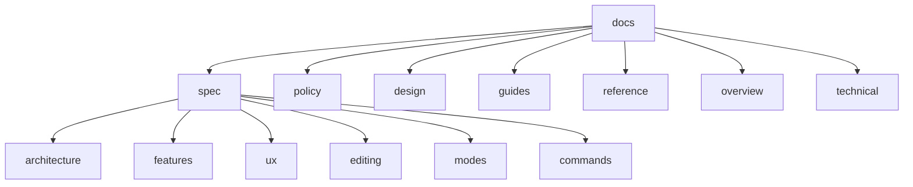

# Documentation

kjxlkj is a Neovim-inspired TUI text editor with all features built-in.

This documentation is optimized for machine (LLM) parsing. See [policy/README.md](policy/README.md) for details.

## Directory Structure

| Directory | Content |
|-----------|---------|
| [spec/](spec/README.md) | Canonical specifications |
| [policy/](policy/README.md) | Operating invariants and rules |
| [design/](design/README.md) | Design rationale |
| [guides/](guides/README.md) | User guides and tutorials |
| [reference/](reference/README.md) | Reference materials |
| [overview/](overview/README.md) | Project overview |
| [technical/](technical/README.md) | Technical implementation |
| [todo/](todo/README.md) | Structured TODO management |

## Quick Start

1. [spec/README.md](spec/README.md) - Canonical specifications
2. [guides/QUICKSTART.md](guides/QUICKSTART.md) - Getting started
3. [spec/ux/keybindings.md](spec/ux/keybindings.md) - Complete keybindings

## Documentation Map

## Next

- Canonical spec: [spec/README.md](spec/README.md)
- Project policies/invariants: [policy/README.md](policy/README.md)
- Getting started: [guides/QUICKSTART.md](guides/QUICKSTART.md)
