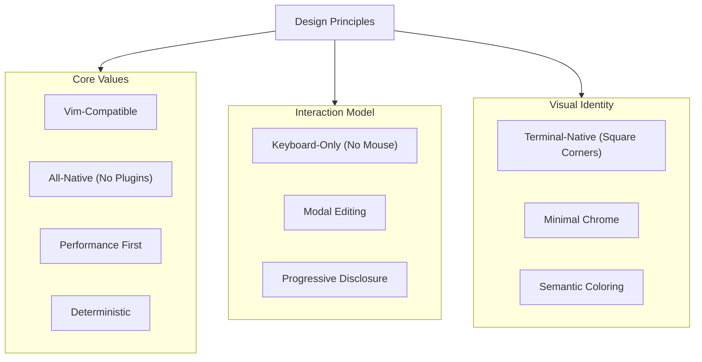

# Design Principles Graph

Back: [/docs/overview/README.md](/docs/overview/README.md)

Visual overview of how design principles relate to each other.

## Principles Topology

## Related

- Overview index: [README.md](README.md)
- Design rationale: [docs/design/README.md](/docs/design/README.md)
