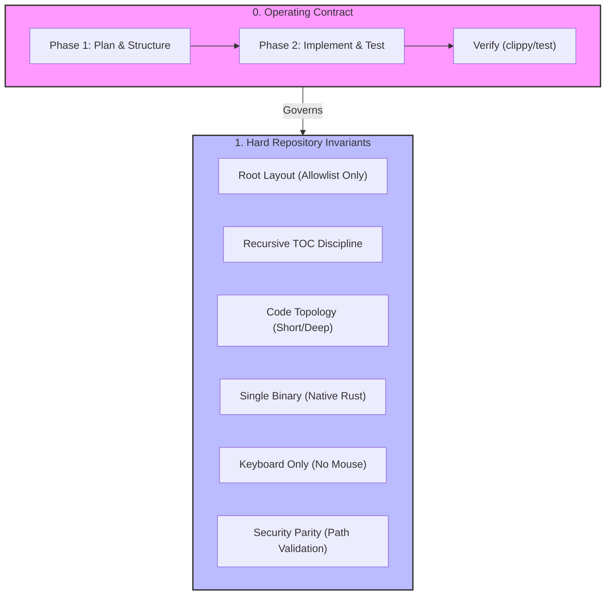

# Operating Contract & Invariants

## Policy Graph

```mermaid
graph TD
    subgraph Contract ["0. Operating Contract"]
        P1["Phase 1: Plan & Structure"] --> P2["Phase 2: Implement & Test"]
        P2 --> V1["Verify (clippy/test)"]
    end

    subgraph Invariants ["1. Hard Repository Invariants"]
        direction LR
        Root["Root Layout (Allowlist Only)"]
        TOC["Recursive TOC Discipline"]
        Code["Code Topology (Short/Deep)"]
        Runtime["Single Binary (Native Rust)"]
        Input["Keyboard Only (No Mouse)"]
        Security["Security Parity (Path Validation)"]
    end

    Contract -->|Governs| Invariants

    %% Relationship constraints
    style Contract fill:#f9f,stroke:#333,stroke-width:2px
    style Invariants fill:#bbf,stroke:#333,stroke-width:2px

```

## Related

- Policy index: [README.md](README.md)
- Structure rules: [STRUCTURE.md](STRUCTURE.md)
