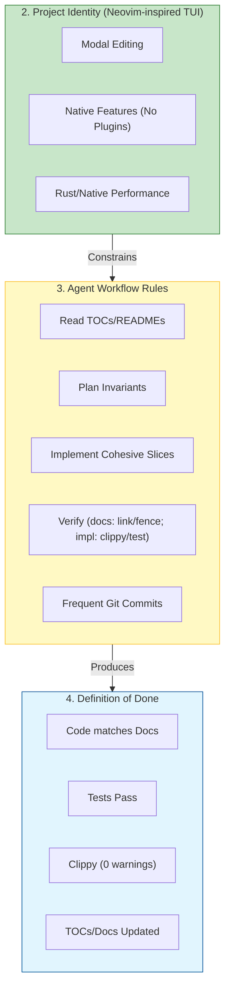

# Agent Workflow & Project Identity

## Workflow Graph

## Verification gate (normative)

This repository treats verification as part of the contract.

- The repository MUST define a standard verification gate under `/docs/` (see `/docs/reference/CI.md`).
- The verification gate MUST be reproducible locally (same commands, same expectations).
- The repository MUST include an automated CI implementation of the verification gate, at the location specified by the docs (see `/docs/reference/CI.md`).
- A change is not considered complete unless the verification gate is green.

In a docs-only baseline, CI configuration and helper scripts are treated as derived artifacts and may be absent. They MUST be reconstructed (per `/docs/reference/CI.md`) before treating the repository as shippable.

## Definition of done (normative)

Work is done only when:

- The implementation matches the normative documents under `/docs/spec/` (or any divergence is explicitly recorded as a limitation under `/docs/reference/`).
- The current TODO iteration is complete (all items checked off, after validating the repository state).
- The verification gate is green (see `/docs/reference/CI.md`).
- The repository includes the required supporting artifacts described by policy and guides, including container-based build/run expectations under `/docs/guides/DOCKER.md`.

## Related

- Policy index: [README.md](README.md)
- Operating contract: [INSTRUCT.md](INSTRUCT.md)
