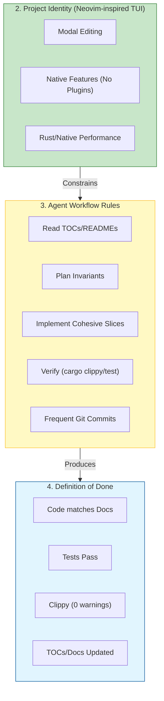

# Agent Workflow & Project Identity

## Workflow Graph

```mermaid
graph TD
    subgraph Identity ["2. Project Identity (Neovim-inspired TUI)"]
        Modal["Modal Editing"]
        Native["Native Features (No Plugins)"]
        Rust["Rust/Native Performance"]
    end

    subgraph Rules ["3. Agent Workflow Rules"]
        Read["Read TOCs/READMEs"]
        Plan["Plan Invariants"]
        Slice["Implement Cohesive Slices"]
        Verify["Verify (cargo clippy/test)"]
        Commit["Frequent Git Commits"]
    end

    subgraph DoD ["4. Definition of Done"]
        DocMatch["Code matches Docs"]
        TestsPass["Tests Pass"]
        ClippyPass["Clippy (0 warnings)"]
        DocsUpdated["TOCs/Docs Updated"]
    end

    Identity -->|Constrains| Rules
    Rules -->|Produces| DoD

    %% Styling
    style Identity fill:#c8e6c9,stroke:#2e7d32
    style Rules fill:#fff9c4,stroke:#fbc02d
    style DoD fill:#e1f5fe,stroke:#01579b

```

## Related

- Policy index: [README.md](README.md)
- Operating contract: [INSTRUCT.md](INSTRUCT.md)
