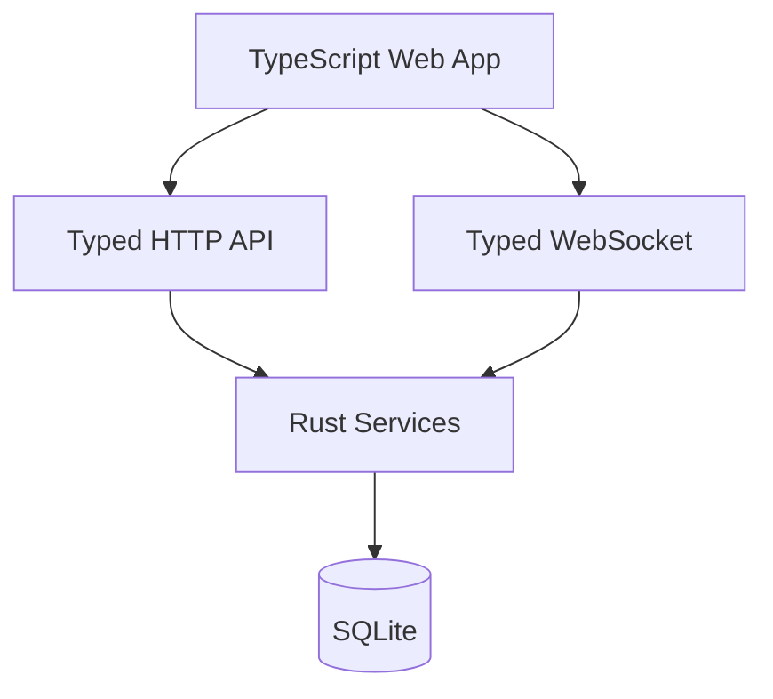

# Architecture

Back: [/docs/spec/README.md](/docs/spec/README.md)

## Documents

| Document | Purpose |
|---|---|
| [runtime.md](runtime.md) | runtime topology and supervision target |
| [deployment.md](deployment.md) | runtime deployment target contract |
| [source-layout.md](source-layout.md) | derived runtime topology constraints |
| [final-file-structure.md](final-file-structure.md) | canonical completion tree and reconstruction projection tree |
| [workspace-manifest.md](workspace-manifest.md) | manifest policy for Rust + TypeScript stack |
| [crates.md](crates.md) | backend Rust crate decomposition |

## System Shape (Reconstruction Target)

## Invariants

- Canonical docs-only state is valid without any runtime artifacts.
- Any reconstructed runtime MUST be regenerated from docs and treated as disposable.
- Mutation ordering MUST be deterministic per stream identity.
- Frontend/backend boundaries MUST be typed and versioned.

## Related

- Type safety: [/docs/spec/technical/type-safety.md](/docs/spec/technical/type-safety.md)
- Domain model: [/docs/spec/domain/README.md](/docs/spec/domain/README.md)
