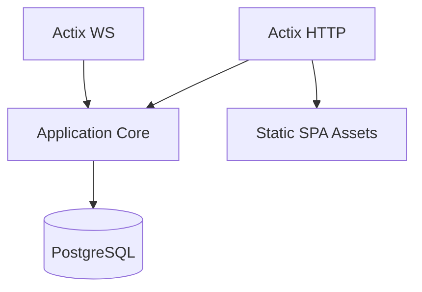

# Architecture

Back: [/docs/spec/README.md](/docs/spec/README.md)

## Documents

| Document | Purpose |
|---|---|
| [configuration.md](configuration.md) | runtime configuration model (`data/config.json` + `.env` secrets) |
| [runtime.md](runtime.md) | Tokio/Actix runtime topology and supervision |
| [crates.md](crates.md) | canonical crate decomposition |
| [source-layout.md](source-layout.md) | workspace and module decomposition constraints |
| [workspace-manifest.md](workspace-manifest.md) | Cargo workspace policy |
| [deployment.md](deployment.md) | single-container compose/process model |
| [completion-file-map.md](completion-file-map.md) | required final repository tree with per-path intent |

## System Shape

## Invariants

- Request handling MUST be async and non-blocking.
- Note mutation ordering MUST be deterministic per note stream.
- Automation mutation ordering MUST be deterministic per target stream.
- Event append and projection updates MUST be transactional.
- App and PostgreSQL MUST run in one compose service container.

## Related

- Runtime: [runtime.md](runtime.md)
- Deployment: [deployment.md](deployment.md)
- Domain model: [/docs/spec/domain/README.md](/docs/spec/domain/README.md)
