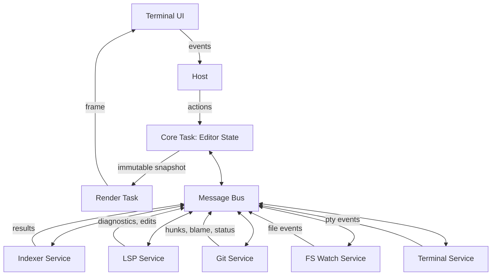

# Architecture

Back: [/docs/spec/README.md](/docs/spec/README.md)
## Documents

| Document | Purpose |
|----------|---------|
| [crates.md](crates.md) | Crate structure |
| [workspace-manifest.md](workspace-manifest.md) | Root workspace manifest and dependency policy |
| [plugins.md](plugins.md) | Plugin architecture |
| [runtime.md](runtime.md) | Runtime design |

## System shape

## Related

- Runtime model: [runtime.md](runtime.md)
