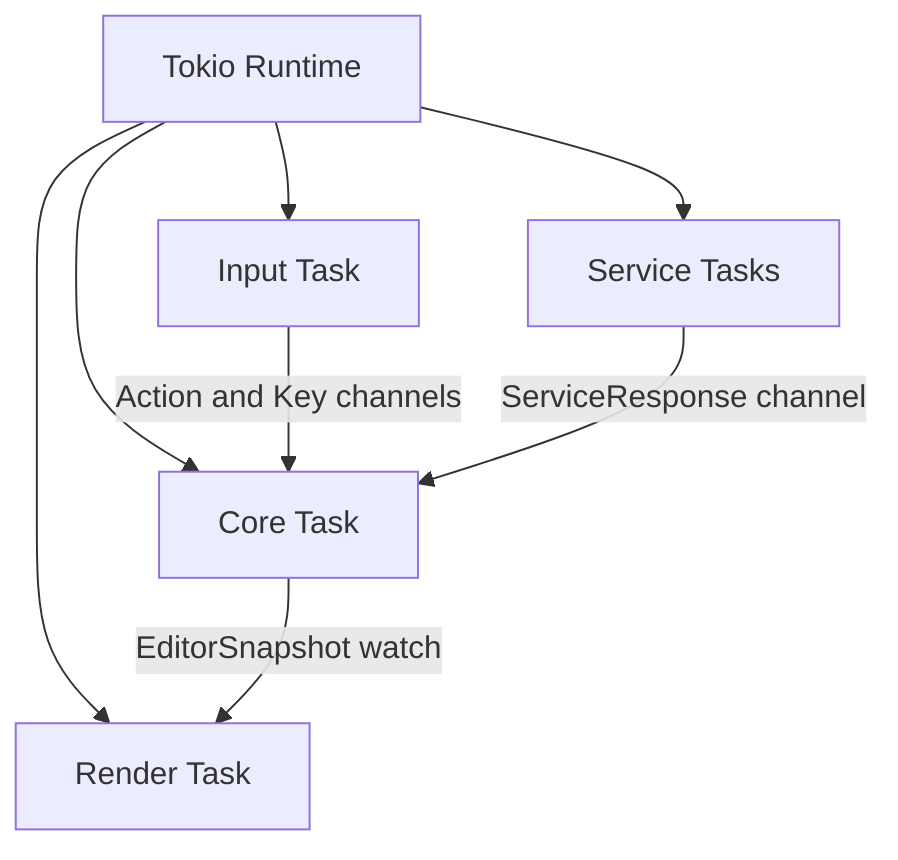

# Architecture

Back: [/docs/spec/README.md](/docs/spec/README.md)

## Documents

| Document | Purpose |
|---|---|
| [crates.md](crates.md) | Workspace crate set and invariants |
| [source-layout.md](source-layout.md) | Reconstruction source tree blueprint |
| [workspace-manifest.md](workspace-manifest.md) | Workspace dependency and manifest policy |
| [plugins.md](plugins.md) | Built-in integration policy (no external plugins) |
| [runtime.md](runtime.md) | Tokio runtime and task topology |
| [render-pipeline.md](render-pipeline.md) | Snapshot-to-frame rendering rules |
| [input-decoding.md](input-decoding.md) | Terminal event decode and key resolution |
| [startup.md](startup.md) | Startup and shutdown sequence |

## System Shape

## Invariants

- `EditorState` has a single mutable owner: the core task.
- Rendering consumes immutable snapshots only.
- IO and long-running work execute in supervised services.
- Input and services communicate with core through bounded channels.
- Source topology follows fan-out and file-size limits from `crates.md` and
  `source-layout.md`.

## Related

- Runtime model: [runtime.md](runtime.md)
- Startup sequence: [startup.md](startup.md)
- Crate topology: [crates.md](crates.md)
