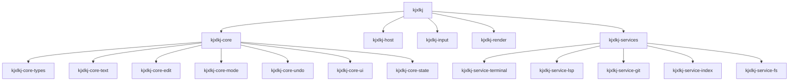

# Crates

Back: [/docs/spec/architecture/README.md](/docs/spec/architecture/README.md)

The implementation is a Cargo workspace under `src/crates/`.

## Topology Requirements

| Requirement | Value |
|---|---|
| Minimum workspace crates | 10 |
| Target crate count | 18 (current design) |
| Directory fan-out target | Around 12 direct children per code directory |
| Source file line cap | 200 lines (split before exceeding) |

## Workspace Members

| Crate | Role |
|---|---|
| `kjxlkj` | Binary runtime orchestration |
| `kjxlkj-core` | Core facade exports |
| `kjxlkj-core-types` | Shared domain types |
| `kjxlkj-core-text` | Rope/text/grapheme model |
| `kjxlkj-core-edit` | Editing primitives |
| `kjxlkj-core-mode` | Mode key/state machines |
| `kjxlkj-core-undo` | Undo tree and persistence |
| `kjxlkj-core-ui` | Snapshot/UI model types |
| `kjxlkj-core-state` | Editor state and action dispatch |
| `kjxlkj-host` | Host terminal lifecycle and signals |
| `kjxlkj-input` | Input decode and key normalization |
| `kjxlkj-render` | Snapshot-to-terminal rendering |
| `kjxlkj-services` | Service supervisor |
| `kjxlkj-service-terminal` | PTY and terminal service |
| `kjxlkj-service-lsp` | LSP service |
| `kjxlkj-service-git` | Git service |
| `kjxlkj-service-index` | Index/finder service |
| `kjxlkj-service-fs` | Filesystem service |

## Decomposition Rules For Rebuild

| Rule | Requirement |
|---|---|
| Large-module split | Any source file over 200 lines MUST be split in the same implementation wave |
| Dispatch split | Large dispatch files MUST split into domain-specific dispatch modules |
| Test split | Large test files SHOULD split by concern (regression, boundary, workflow) |
| Directory balancing | If a source directory grows far beyond 12 children, introduce submodules grouped by domain |

## Current Hotspots To Split Next

These are known high-risk structure hotspots to address during reimplementation:

- `src/crates/kjxlkj-core-state/src/`
- `src/crates/kjxlkj-core-edit/src/`
- `src/crates/kjxlkj-core-mode/src/`

Required split planning details are tracked in:

- [/docs/log/audits/source-topology-and-oversize-2026-02-09.md](/docs/log/audits/source-topology-and-oversize-2026-02-09.md)

## Workspace Overview

## Related

- Runtime model: [runtime.md](runtime.md)
- Startup sequence: [startup.md](startup.md)
- Structure policy: [/docs/policy/STRUCTURE.md](/docs/policy/STRUCTURE.md)
