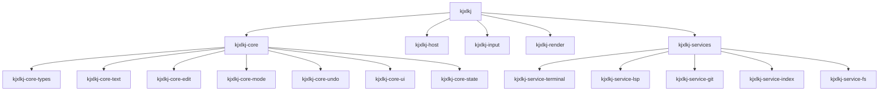

# Crates

Back: [/docs/spec/architecture/README.md](/docs/spec/architecture/README.md)

The implementation is a Cargo workspace under `src/crates/`.

## Topology Requirements

| Requirement | Value |
|---|---|
| Minimum workspace crates | 10 |
| Target crate count | 18 |
| Max direct children per source directory | around 12 |
| Max source file length | 200 lines |

## Workspace Members

| Crate | Role |
|---|---|
| `kjxlkj` | Binary runtime orchestration |
| `kjxlkj-core` | Core facade exports |
| `kjxlkj-core-types` | Shared domain types |
| `kjxlkj-core-text` | Rope/text/grapheme model |
| `kjxlkj-core-edit` | Editing primitives |
| `kjxlkj-core-mode` | Mode key/state machines |
| `kjxlkj-core-undo` | Undo tree and persistence |
| `kjxlkj-core-ui` | Snapshot/UI model types |
| `kjxlkj-core-state` | Editor state and action dispatch |
| `kjxlkj-host` | Host terminal lifecycle and signals |
| `kjxlkj-input` | Input decode and key normalization |
| `kjxlkj-render` | Snapshot-to-terminal rendering |
| `kjxlkj-services` | Service supervisor |
| `kjxlkj-service-terminal` | PTY and terminal service |
| `kjxlkj-service-lsp` | LSP service |
| `kjxlkj-service-git` | Git service |
| `kjxlkj-service-index` | Index/finder service |
| `kjxlkj-service-fs` | Filesystem service |

## Decomposition Rules

| Rule | Requirement |
|---|---|
| Split before overflow | Any source file trending toward 200 lines MUST be split in the same wave |
| Domain dispatch split | Large dispatch logic MUST be split by domain (mode, command, service, UI) |
| Test split | Test files SHOULD be split by concern (unit, integration, E2E, regression) |
| Fan-out balancing | If a source directory exceeds around 12 direct children, create subdirectories by domain |

## Reconstruction Contract

- A TODO item MAY be closed only when the feature is wired from real input path
  to observable behavior.
- Every crate MUST expose a deterministic test entry for touched behaviors.
- Any crate marked complete MUST satisfy the layout template in
  [source-layout.md](source-layout.md).

## Workspace Overview

## Related

- Runtime model: [runtime.md](runtime.md)
- Source layout blueprint: [source-layout.md](source-layout.md)
- Structure policy: [/docs/policy/STRUCTURE.md](/docs/policy/STRUCTURE.md)
