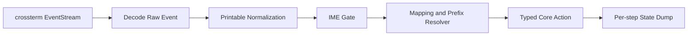

# Input Decoding Detail

Back: [/docs/spec/architecture/README.md](/docs/spec/architecture/README.md)

This document defines how terminal events become deterministic editor actions.

## Pipeline

## Stage Order (normative)

For every key event, stages MUST run in this exact order:

1. decode raw terminal event to internal key model
2. normalize printable keys (`Shift+a` -> `A`) before mode dispatch
3. run IME gate when Insert composition is active
4. resolve mappings, prefixes, counts, and operator continuations
5. emit one typed action to core
6. capture deterministic post-action state dump for E2E assertions

No later stage may reinterpret printable identity from an earlier stage.

## Raw Event Mapping

| Raw Event | Output |
|---|---|
| `Key(KeyEvent)` | key pipeline above |
| `Resize(cols, rows)` | `Action::Resize(cols, rows)` |
| `Paste(text)` | `Action::Paste(text)` in one undo group |
| `FocusGained` | `Action::FocusGained` |
| `FocusLost` | `Action::FocusLost` |
| `Mouse(_)` | ignored deterministically |

UTF-8 printable bytes MUST be assembled into one scalar-char key event before
normalization and routing.

## Printable Normalization Rules

| Rule | Requirement |
|---|---|
| Alpha shift | printable shifted alpha keys become uppercase chars |
| Modifier collapse | printable shift modifier is absorbed into normalized char |
| Dispatch precedence | mode handlers consume normalized key, not raw modifier pair |
| Symmetry | physical `A` and `Shift+a` are indistinguishable downstream |

## Prefix and Mapping Resolver

| Surface | Requirement |
|---|---|
| Prefix buffers | explicit state machine with deterministic timeout fallback |
| Counts | parsed before final command dispatch |
| Operator pending | accepts only valid continuation tokens |
| Leader mappings | evaluated only when IME gate returns `pass` |

Timeout handling must produce either resolved mapping or deterministic literal fallback.

## IME Gate Contract

IME gate runs after normalization and before mapping resolution.

| Context | Behavior |
|---|---|
| Insert + composition active | IME gets first consume/pass decision |
| `Space` during composition | consumed by IME candidate workflow |
| `Esc` during composition | cancels composition before mode transition |
| Insert + no composition | pass to mapping resolver |

## State Dump Contract for E2E

After each key input, dump rows must include:

- `event_seq`
- `mode_before`
- `mode_after`
- `raw_key`
- `normalized_key`
- `resolved_action`
- `focused_window_id`
- `focused_window_type`
- `layout_summary`
- `frame_excerpt`
- `cursor_or_caret`
- `recent_events` (bounded)

## Mandatory Verification

| ID | Scenario | Required Assertions |
|---|---|---|
| `KEY-TRACE-01` | raw `Shift+a` yields normalized `A` before mode dispatch | dump ordering proves normalize-before-dispatch |
| `KEY-TRACE-02` | IME composition `Space` is consumed | no leader action in dump timeline |
| `KEY-TRACE-03` | `:Explorer` and `<leader>e` routing | route and pane outcome appear in dumps |
| `KEY-TRACE-04` | `:terminal` and `<leader>t` routing | route and pane outcome appear in dumps |
| `KEY-TRACE-06` | UTF-8 multibyte input | one normalized scalar-char event only |
| `KEY-TRACE-07` | diagnostics completeness | dump includes `layout_summary` and `frame_excerpt` |
| `KEY-SCREEN-02` | normalization symmetry | frame timeline for physical `A` equals `Shift+a` timeline |
| `WR-01R` | user-like append flow | final frame matches append-at-EOL oracle |

## Related

- Runtime model: [/docs/spec/architecture/runtime.md](/docs/spec/architecture/runtime.md)
- Mode entry keys: [/docs/spec/ux/keybindings/mode-entry.md](/docs/spec/ux/keybindings/mode-entry.md)
- IME behavior: [/docs/spec/modes/insert/input/insert-japanese-ime.md](/docs/spec/modes/insert/input/insert-japanese-ime.md)
- E2E matrix: [/docs/spec/technical/testing-e2e.md](/docs/spec/technical/testing-e2e.md)
