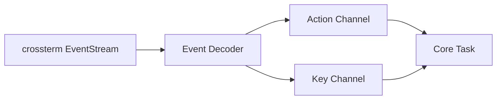

# Input Decoding Detail

Back: [/docs/spec/architecture/README.md](/docs/spec/architecture/README.md)

This document specifies how terminal events become editor actions and keys.

## Pipeline

## Event Reading Rules

- Input reader runs as a dedicated async task.
- Reads use `crossterm::event::EventStream`.
- Backpressure is applied by bounded channels.
- Decoder MUST NOT block the runtime.

## Event Mapping

| Event | Mapping |
|---|---|
| `Key(KeyEvent)` | Decode into internal `Key` and send on key channel |
| `Resize(cols, rows)` | Send `Action::Resize(cols, rows)` |
| `Paste(text)` | Send `Action::Paste(text)` |
| `FocusGained` | Send `Action::FocusGained` |
| `FocusLost` | Send `Action::FocusLost` |
| `Mouse(MouseEvent)` | Discard (keyboard-only invariant) |

## Key Decoding Rules

- Preserve key code identity (`Char`, arrows, function keys, etc.).
- Preserve modifier bits (Ctrl, Alt, Shift).
- Normalize printable shifted keys so command dispatch can distinguish `a` vs `A`.

## Keybinding Resolution Rules

- Keybinding resolution is mode-aware.
- Prefix sequences MUST support timeout behavior.
- Count prefix and register prefix MUST be carried into resolved actions.
- Operator-pending resolution MUST accept both motion and text-object followups.

## Paste Rules

- Bracketed paste inserts text literally.
- Paste payload should be applied as a single undo group.

## Related

- Runtime model: [/docs/spec/architecture/runtime.md](/docs/spec/architecture/runtime.md)
- Keyboard requirements: [/docs/spec/ux/keybindings.md](/docs/spec/ux/keybindings.md)
- Mouse non-goal: [/docs/spec/features/config/mouse-support.md](/docs/spec/features/config/mouse-support.md)
