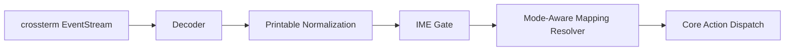

# Input Decoding Detail

Back: [/docs/spec/architecture/README.md](/docs/spec/architecture/README.md)

This document specifies how terminal events become deterministic editor actions.

## Pipeline

## Stage Order (normative)

The decoder MUST apply these stages in this exact order for every key event:

1. decode raw terminal event into internal key representation
2. normalize printable shifted keys (`Shift+a` -> `A`) before mode dispatch
3. apply IME composition gate (Insert mode only)
4. resolve mappings (`<leader>`, counts, registers, operator-pending)
5. emit one typed action/key event to core

A later stage MUST NOT re-interpret earlier-stage normalized printable identity.

## Event Reading Rules

- input reader runs as a dedicated async task
- reads use `crossterm::event::EventStream`
- decoder channels are bounded and non-blocking for core responsiveness
- mouse events are ignored (keyboard-first invariant)

## Terminal Event Mapping

| Event | Mapping |
|---|---|
| `Key(KeyEvent)` | decode + normalize + route via mapping pipeline |
| `Resize(cols, rows)` | emit `Action::Resize(cols, rows)` |
| `Paste(text)` | emit `Action::Paste(text)` as one undo group |
| `FocusGained` | emit `Action::FocusGained` |
| `FocusLost` | emit `Action::FocusLost` |
| `Mouse(MouseEvent)` | ignore deterministically |

## Printable Shift Normalization

| Rule | Requirement |
|---|---|
| Alpha normalization | `Shift+a` MUST decode as `A`, not raw `a + Shift` |
| Mode independence | normalization happens before mode handler selection |
| Raw-shift isolation | mode handlers MUST NOT depend on raw shift modifier for printable commands |

Examples:

| Raw Input | Normalized Key |
|---|---|
| `Shift+a` | `A` |
| `Shift+o` | `O` |
| `Shift+i` | `I` |

## IME Routing Rules

The IME gate executes after printable normalization and before mapping resolution.

| Context | Behavior |
|---|---|
| Insert + composition active | IME handler gets first chance to consume key |
| `Space` during composition | MUST be consumed by IME candidate workflow, not `<leader>` mapping |
| `Esc` during composition | MUST cancel composition first |
| Insert + no composition | continue to mapping/insert dispatch |

## Mapping Resolution Rules

- mapping resolution is mode-aware and deterministic
- prefix sequences use explicit timeout behavior
- operator-pending accepts motion and text-object continuations
- resolved outputs are typed actions, never free-form strings

## Diagnostics and Traceability

Decoder and dispatch layers MUST emit trace points for:

- raw terminal event
- normalized key
- IME gate decision (`consumed` or `pass`)
- final resolved action/key

These trace points are required for regression debugging in high-risk key-routing bugs.

## Mandatory Verification

| ID | Scenario |
|---|---|
| `KEY-TRACE-01` | raw `Shift+a` produces normalized `A` trace before mode dispatch |
| `KEY-TRACE-02` | IME composition `Space` emits consume trace and no leader action |
| `KEY-TRACE-03` | resolved `:Explorer`/`<leader>e` path is visible in dispatch trace |
| `KEY-TRACE-04` | resolved `:terminal`/`<leader>t` path is visible in dispatch trace |

## Related

- Runtime model: [/docs/spec/architecture/runtime.md](/docs/spec/architecture/runtime.md)
- Mode entry keybindings: [/docs/spec/ux/keybindings/mode-entry.md](/docs/spec/ux/keybindings/mode-entry.md)
- IME behavior: [/docs/spec/modes/insert/input/insert-japanese-ime.md](/docs/spec/modes/insert/input/insert-japanese-ime.md)
- E2E testing: [/docs/spec/technical/testing-e2e.md](/docs/spec/technical/testing-e2e.md)
