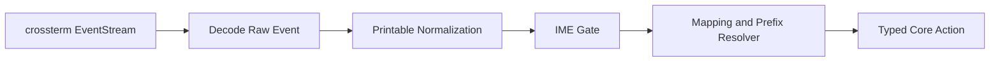

# Input Decoding Detail

Back: [/docs/spec/architecture/README.md](/docs/spec/architecture/README.md)

This document defines how terminal events become deterministic editor actions.

## Pipeline

## Stage Order (normative)

For every key event, stages MUST run in this exact order:

1. decode raw terminal event to internal key model
2. normalize printable keys (`Shift+a` -> `A`) before mode dispatch
3. run IME gate when Insert composition is active
4. resolve mappings, prefixes, counts, and operator continuations
5. emit one typed action to core

No later stage may reinterpret printable identity from an earlier stage.

## Raw Event Mapping

| Raw Event | Output |
|---|---|
| `Key(KeyEvent)` | key pipeline above |
| `Resize(cols, rows)` | `Action::Resize(cols, rows)` |
| `Paste(text)` | `Action::Paste(text)` in one undo group |
| `FocusGained` | `Action::FocusGained` |
| `FocusLost` | `Action::FocusLost` |
| `Mouse(_)` | ignored deterministically |

## Printable Normalization Rules

| Rule | Requirement |
|---|---|
| Alpha shift | printable shifted alpha keys become uppercase chars (`A`..`Z`) |
| Modifier collapse | printable shift modifier is absorbed into normalized char |
| Dispatch precedence | mode handlers consume normalized key, not raw shift pair |
| Symmetry | `Shift+a` and physical `A` must be indistinguishable downstream |

### Required Examples

| Raw Key | Normalized Key |
|---|---|
| `Shift+a` | `A` |
| `Shift+o` | `O` |
| `Shift+i` | `I` |
| `Ctrl+w` | `Ctrl+w` |
| `Esc` | `Esc` |

## Prefix and Mapping Resolver

Resolver behavior MUST be deterministic and bounded.

| Surface | Requirement |
|---|---|
| Prefix buffers | explicit state machine with timeout and deterministic fallback |
| Counts | parsed before final command dispatch |
| Operator pending | accepts only valid motion/text-object continuation |
| Leader mappings | evaluated only when IME gate returns `pass` |

Timeout handling MUST produce one of two outcomes only:

1. resolved mapping action
2. deterministic fallback to literal key actions

## IME Gate Contract

IME gate runs after normalization and before mapping resolution.

| Context | Behavior |
|---|---|
| Insert + composition active | IME handler gets first consume/pass decision |
| `Space` during composition | consumed by IME candidate workflow; no leader mapping |
| `Esc` during composition | cancels composition before mode transition |
| Insert + no composition | pass to mapping resolver |

## Trace and Diagnostics Contract

Decoder and dispatch layers MUST emit trace points for:

- raw terminal event
- normalized key
- IME gate decision (`consume` or `pass`)
- mapping resolution decision
- final typed action

These trace fields are mandatory in blocker diagnostics:

- `event_seq`
- `mode_before`
- `focused_window_id`
- `normalized_key`
- `resolved_action`

## Mandatory Verification

| ID | Scenario |
|---|---|
| `KEY-TRACE-01` | raw `Shift+a` yields normalized `A` before mode dispatch |
| `KEY-TRACE-02` | IME composition `Space` consumes and emits no leader action |
| `KEY-TRACE-03` | `:Explorer` and `<leader>e` paths appear in action trace |
| `KEY-TRACE-04` | `:terminal` and `<leader>t` paths appear in action trace |
| `WR-01R` | PTY raw bytes for `Shift+a` produce append semantics in runtime |

## Related

- Runtime model: [/docs/spec/architecture/runtime.md](/docs/spec/architecture/runtime.md)
- Mode entry keys: [/docs/spec/ux/keybindings/mode-entry.md](/docs/spec/ux/keybindings/mode-entry.md)
- IME behavior: [/docs/spec/modes/insert/input/insert-japanese-ime.md](/docs/spec/modes/insert/input/insert-japanese-ime.md)
- E2E matrix: [/docs/spec/technical/testing-e2e.md](/docs/spec/technical/testing-e2e.md)
