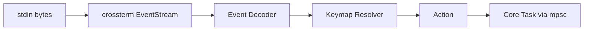

# Input Decoding Detail

Back: [/docs/spec/architecture/README.md](/docs/spec/architecture/README.md)

This document specifies how raw terminal bytes become editor actions. It extends the summary in [/docs/spec/architecture/runtime.md](/docs/spec/architecture/runtime.md).

## Pipeline overview

## Terminal event reading (normative)

- The input reader runs as a dedicated Tokio task.
- It consumes `crossterm::event::EventStream` which yields `crossterm::event::Event` values.
- The task MUST NOT block the Tokio runtime; all reads are async via `futures_core::Stream`.
- Backpressure: the `mpsc::Sender<Action>` channel (bounded, 256) applies backpressure. If the core task is slow, the input reader blocks on send.

## Event types (normative)

| crossterm Event | Mapping |
|---|---|
| `Key(KeyEvent)` | Resolve through keybinding table |
| `Mouse(MouseEvent)` | Map to click, drag, scroll, or release actions |
| `Resize(cols, rows)` | Emit `Action::Resize(cols, rows)` directly |
| `Paste(text)` | Emit `Action::Paste(text)` (bracketed paste mode) |
| `FocusGained` | Emit `Action::FocusGained` |
| `FocusLost` | Emit `Action::FocusLost` |

## Key event decoding (normative)

A `KeyEvent` contains a `KeyCode` and `KeyModifiers`. The decoder MUST normalize as follows:

### Modifier normalization

| Raw modifier state | Normalized form |
|---|---|
| Ctrl + Shift + letter | `C-S-{uppercase letter}` |
| Ctrl + letter | `C-{lowercase letter}` |
| Alt + letter | `M-{letter}` (M for Meta) |
| Alt + Ctrl + letter | `M-C-{letter}` |
| Shift + special key | `S-{key}` |
| No modifier + letter | literal character |

### Special key codes

| KeyCode | Internal name |
|---|---|
| `Backspace` | `BS` |
| `Enter` | `CR` |
| `Tab` | `Tab` |
| `BackTab` (Shift+Tab) | `S-Tab` |
| `Delete` | `Del` |
| `Insert` | `Insert` |
| `Home` | `Home` |
| `End` | `End` |
| `PageUp` | `PageUp` |
| `PageDown` | `PageDown` |
| `Up` | `Up` |
| `Down` | `Down` |
| `Left` | `Left` |
| `Right` | `Right` |
| `F(n)` | `F{n}` |
| `Esc` | `Esc` |
| `Null` | ignored |

## Keybinding resolution (normative)

The keybinding table is a trie (prefix tree) keyed by mode and key sequence.

### Resolution algorithm

1. On receiving a key event, append it to the pending key sequence buffer.
2. Look up the current mode's keybinding trie for the accumulated sequence.
3. Possible outcomes:
   - **Exact match**: emit the bound action, clear the buffer.
   - **Prefix match**: wait for more keys. Start a timeout (default: `timeoutlen = 1000 ms`).
   - **No match**: if the buffer length is 1, treat as unmapped key (insert in Insert mode, beep in Normal mode). If the buffer length is > 1, replay the first key as unmapped, then re-process remaining keys.
4. On timeout expiry: if the buffer is a valid shorter match, emit that action. Otherwise treat the first key as unmapped and re-process.

### Operator-pending mode

When a Normal-mode key triggers an operator (e.g., `d`, `c`, `y`), the mode transitions to OperatorPending. The next key sequence is resolved against the motion/text-object keybinding table. Resolution:

1. If a valid motion or text-object is entered, perform the operator with that range and return to Normal mode.
2. If the operator key is repeated (e.g., `dd`, `cc`, `yy`), operate on the current line.
3. On `Esc` or timeout, cancel and return to Normal mode.

### Count prefix

Before any key sequence, a numeric count may be entered. The decoder MUST:

1. Accumulate digit characters (`1`–`9` for the first digit, `0`–`9` for subsequent digits) into a count.
2. When a non-digit key arrives, attach the count to the resolved action.
3. `0` alone is NOT a count; it maps to the "go to column 0" motion.

### Register prefix

Before an operator or yank/paste, a register may be specified with `"` followed by a register name character. The decoder MUST:

1. On `"`, enter register-pending state.
2. On the next character, record it as the register name and exit register-pending state.
3. Attach the register to the subsequent operator or put action.

## Mouse event mapping (normative)

| Mouse event | Action |
|---|---|
| Left click at (col, row) | Move cursor to position; switch to target window if needed |
| Left drag | Start or extend visual selection |
| Left release | Finalize visual selection |
| Right click | Contextual; reserved |
| Scroll up | Scroll buffer up by `scrolloff` lines |
| Scroll down | Scroll buffer down by `scrolloff` lines |
| Middle click | Paste from system clipboard |

## Bracketed paste (normative)

When the terminal sends bracketed paste events:

1. All pasted text MUST be inserted literally, without interpreting any characters as commands.
2. In Normal mode, bracketed paste switches to Insert mode, inserts the text, then returns to Normal mode.
3. In Insert mode, bracketed paste inserts at the cursor position.
4. The `paste` action MUST batch the entire pasted text as a single undo entry.

## Focus events (normative)

| Event | Behavior |
|---|---|
| `FocusGained` | Trigger auto-read checks for externally modified buffers. Resume cursor blink. |
| `FocusLost` | Trigger auto-save if configured. Suspend cursor blink. |

## Action type catalog (normative)

The `Action` enum MUST include at minimum:

| Category | Variants |
|---|---|
| Movement | `MoveCursor(motion)`, `Scroll(direction, amount)` |
| Editing | `Insert(char)`, `Delete(motion)`, `Change(motion)`, `Yank(motion)`, `Put(before_or_after)`, `Replace(char)` |
| Mode | `EnterInsert(position)`, `EnterVisual(kind)`, `EnterCommand`, `EnterReplace`, `ReturnToNormal` |
| Command | `ExecuteCommand(string)`, `CmdlineChar(char)`, `CmdlineBackspace`, `CmdlineComplete` |
| Buffer | `OpenFile(path)`, `Write`, `WriteQuit`, `Quit`, `QuitAll` |
| Window | `SplitHorizontal`, `SplitVertical`, `CloseWindow`, `FocusWindow(direction)` |
| Search | `SearchForward(pattern)`, `SearchBackward(pattern)`, `NextMatch`, `PrevMatch` |
| Undo | `Undo`, `Redo` |
| Macro | `RecordMacro(register)`, `PlayMacro(register)` |
| System | `Resize(cols, rows)`, `Paste(text)`, `FocusGained`, `FocusLost`, `QuitSignal` |

## Related

- Runtime model: [/docs/spec/architecture/runtime.md](/docs/spec/architecture/runtime.md)
- Key binding reference: [/docs/reference/CONFORMANCE_KEYS_INPUT.md](/docs/reference/CONFORMANCE_KEYS_INPUT.md)
- Mode transitions: [/docs/spec/modes/README.md](/docs/spec/modes/README.md)
- Operator-pending: [/docs/spec/modes/operator-pending/README.md](/docs/spec/modes/operator-pending/README.md)
