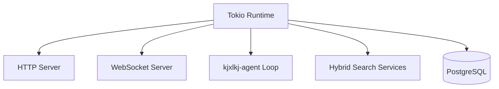

# Runtime Model

Back: [/docs/spec/architecture/README.md](/docs/spec/architecture/README.md)

## Runtime Topology

## Startup Sequence

1. load `.env`
2. load `data/config.json`
3. load `data/agent-prompt.json`
4. initialize DB pool and migrations
5. start HTTP + WS services
6. start background jobs
7. start `kjxlkj-agent` loop

## Concurrency Rules

- note writes serialize by note ID
- search reindex jobs are idempotent and resumable
- agent mutations obey workspace scope and optimistic version checks
- WS ordering follows committed sequence

## Related

- Configuration: [configuration.md](configuration.md)
- Search domain: [/docs/spec/domain/search.md](/docs/spec/domain/search.md)
- Agent contract: [/docs/spec/technical/librarian-agent.md](/docs/spec/technical/librarian-agent.md)
