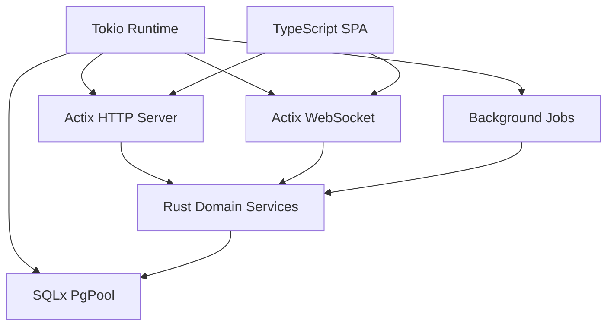

# Runtime Model

Back: [/docs/spec/architecture/README.md](/docs/spec/architecture/README.md)

## Runtime Topology (Derived Snapshot)

## Startup Sequence

1. load and validate configuration
2. initialize tracing
3. initialize PostgreSQL pool
4. run pending migrations
5. start HTTP + WS services
6. start background workers

## Shutdown Sequence

1. stop accepting new connections
2. drain active HTTP/WS tasks with bounded timeout
3. flush telemetry and close DB pool
4. terminate process cleanly

## Concurrency Rules

- note writes MUST serialize by note stream identity
- automation writes MUST serialize by target stream identity
- websocket broadcast ordering MUST follow committed event sequence
- slow clients MUST NOT block global broadcast loops

## Typed Boundary Rule

- API payloads MUST map to typed backend structs and frontend TypeScript contracts
- ad-hoc untyped runtime JSON handling is forbidden in core flows

## Related

- Deployment: [deployment.md](deployment.md)
- Type safety: [/docs/spec/technical/type-safety.md](/docs/spec/technical/type-safety.md)
- Operations: [/docs/spec/technical/operations.md](/docs/spec/technical/operations.md)
