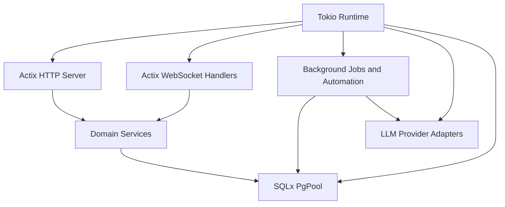

# Runtime Model

Back: [/docs/spec/architecture/README.md](/docs/spec/architecture/README.md)

## Runtime Topology

## Startup Sequence (normative)

1. load and validate configuration
2. initialize tracing and error handling
3. initialize PostgreSQL pool
4. run pending SQL migrations
5. start Actix server with HTTP + WS routes
6. initialize LLM provider adapters (OpenRouter/LM Studio)
7. start background workers (automation/export/backup/job polling)

## Shutdown Sequence

1. stop accepting new connections
2. drain active HTTP/WS tasks with bounded timeout
3. flush telemetry and close DB pool
4. terminate process cleanly

## Concurrency Rules

- Writes to one note stream MUST serialize by note ID lock or transaction strategy.
- Automation writes MUST serialize by target stream identity.
- Librarian operation application MUST serialize by workspace + target note stream.
- Cross-stream writes MAY run in parallel.
- WS broadcast ordering MUST follow committed event sequence.
- Slow clients MUST NOT block global broadcast loops.

## Related

- Domain events: [/docs/spec/domain/events.md](/docs/spec/domain/events.md)
- Automation: [/docs/spec/domain/automation.md](/docs/spec/domain/automation.md)
- Librarian protocol: [/docs/spec/api/librarian-xml.md](/docs/spec/api/librarian-xml.md)
- Operations: [/docs/spec/technical/operations.md](/docs/spec/technical/operations.md)
