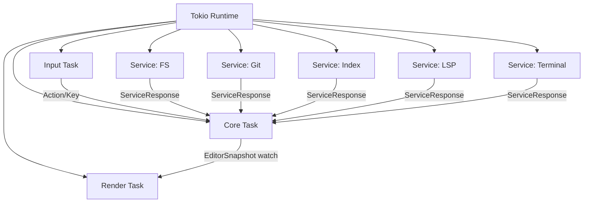

# Tokio Runtime Model

Back: [/docs/spec/architecture/README.md](/docs/spec/architecture/README.md)

## Runtime Topology

## Event Loop (Normative)

`main` MUST initialize a multi-thread Tokio runtime and start tasks in this order:

1. Host setup (raw mode, alternate screen, bracketed paste, focus reporting).
2. Core task creation (single mutable owner of `EditorState`).
3. Render task start (`watch::Receiver<EditorSnapshot>` consumer).
4. Input task start (`EventStream` decoder).
5. Service task start (FS, Git, Index, LSP, Terminal).
6. Shutdown select loop on quit signal, fatal task exit, or explicit quit action.

## Channel Topology

| Channel | Type | Capacity | Sender | Receiver |
|---|---|---:|---|---|
| Input action bus | `mpsc::Sender<Action>` | 256 | Input task | Core task |
| Input key bus | `mpsc::Sender<Key>` | 256 | Input task | Core task |
| Service response bus | `mpsc::Sender<ServiceResponse>` | 256 | Service tasks | Core task |
| Core to service request bus | per-service `mpsc::Sender<ServiceRequest>` | 64 | Core task | Each service |
| Snapshot bus | `watch::Sender<EditorSnapshot>` | latest-wins | Core task | Render task |
| Quit signal | `broadcast::Sender<()>` | 1 | Core task | Input/render/services |

## Message Bus Rules

- The service bus is typed and bounded.
- Core MUST remain responsive when services are slow.
- Service responses MUST be idempotent and safe to process out-of-order when request IDs differ.
- Unrecognized responses MUST be ignored with diagnostic logging.

## Shutdown Rules

1. Core sets quit state and broadcasts quit signal.
2. Input/render/service tasks receive quit and stop gracefully.
3. Runtime awaits task join handles with bounded timeout.
4. Terminal host is restored before process exit.

## Related

- Startup details: [/docs/spec/architecture/startup.md](/docs/spec/architecture/startup.md)
- Render details: [/docs/spec/architecture/render-pipeline.md](/docs/spec/architecture/render-pipeline.md)
- Input decoding: [/docs/spec/architecture/input-decoding.md](/docs/spec/architecture/input-decoding.md)
