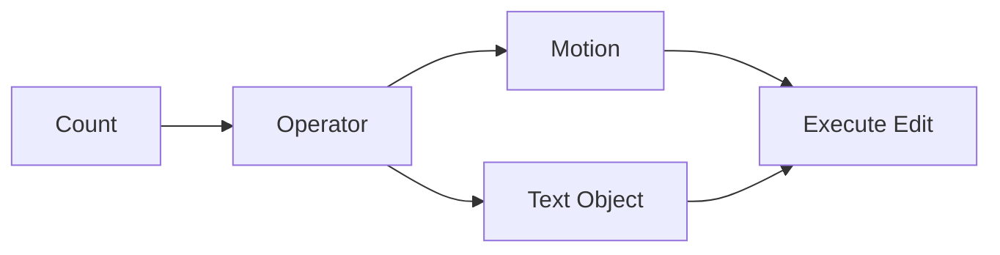

# Editing

Back: [/docs/spec/README.md](/docs/spec/README.md)
Editing primitives are deterministic core operations.

## Operator Grammar

## Directory Structure

| Directory | Content |
|-----------|---------|
| [cursor/](cursor/README.md) | Cursor semantics |
| [macros/](macros/README.md) | Macro recording |
| [marks/](marks/README.md) | Mark system |
| [motions/](motions/README.md) | Cursor motions |
| [operators/](operators/README.md) | Edit operators |
| [regex/](regex/README.md) | Regular expressions |
| [registers/](registers/README.md) | Register system |
| [search/](search/README.md) | Search |
| [text-manipulation/](text-manipulation/README.md) | Text transforms |
| [text-objects/](text-objects/README.md) | Text objects |
| [visual/](visual/README.md) | Visual editing |

## Model

| Component | Purpose |
|-----------|---------|
| Motions | Define cursor movement |
| Text objects | Define text regions |
| Operators | Transform text |
| Registers | Store text |
| Transactions | Group edits for undo |

## Determinism Requirements

| Requirement | Meaning |
|-------------|---------|
| Transactional | Composite edits are one undo step |
| Versioned | Edits target known buffer version |
| Conflict-safe | Multi-cursor edits resolve deterministically |

## Related

- Modes: [docs/spec/modes/README.md](/docs/spec/modes/README.md)
- Commands: [docs/spec/commands/README.md](/docs/spec/commands/README.md)
