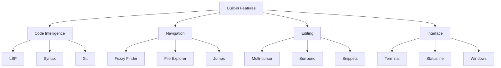

# Built-in Features

Back: [/docs/spec/README.md](/docs/spec/README.md)
kjxlkj has no plugin system. All features are built-in natively.

## Feature Categories

## Directory Structure

| Directory | Content |
|-----------|---------|
| [buffer/](buffer/README.md) | Buffer management |
| [config/](config/README.md) | Configuration |
| [editing/](editing/README.md) | Editing helpers |
| [git/](git/README.md) | Git integration |
| [lsp/](lsp/README.md) | LSP features |
| [navigation/](navigation/README.md) | Navigation |
| [session/](session/README.md) | Session persistence |
| [syntax/](syntax/README.md) | Syntax highlighting |
| [terminal/](terminal/README.md) | Terminal |
| [ui/](ui/README.md) | UI components |
| [window/](window/README.md) | Window management |

## Feature Activation

| Key | Feature |
|-----|---------|
| `<leader>e` | File Explorer |
| `<leader>t` | Terminal |
| `<leader>f` | Fuzzy Finder |

## Related

- Architecture: [docs/spec/architecture/README.md](/docs/spec/architecture/README.md)
- UX: [docs/spec/ux/README.md](/docs/spec/ux/README.md)
