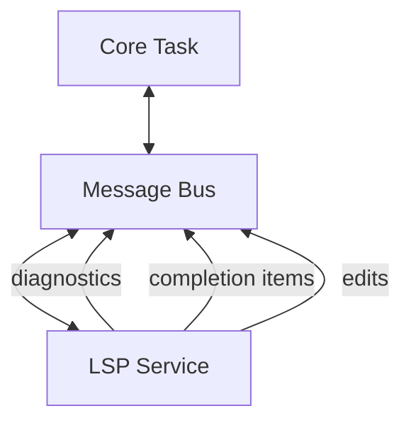

# LSP + Completion

## User intent

Language intelligence:

- Diagnostics, go-to definition, references
- Hover and signature help
- Rename and code actions
- Completion with snippets

## Service model

LSP MUST be implemented as a supervised Tokio service.

## Acceptance criteria

| Scenario | Requirement |
|----------|-------------|
| Large file open | Diagnostics MUST appear within 2 seconds of server initialization |
| Completion trigger | Typing a trigger character MUST show completions within 500ms |
| Go-to-definition | Navigation MUST complete within 1 second for local symbols |
| Service failure | If LSP server crashes, UI MUST show actionable error and offer restart |
| Multiple servers | Multiple language servers MAY run concurrently without conflict |
| Cancellation | Long-running hover/completion requests MUST be cancellable |

## Related

- Features index: [docs/spec/features/README.md](/docs/spec/features/README.md)
- Runtime model: [docs/spec/architecture/runtime.md](/docs/spec/architecture/runtime.md)
