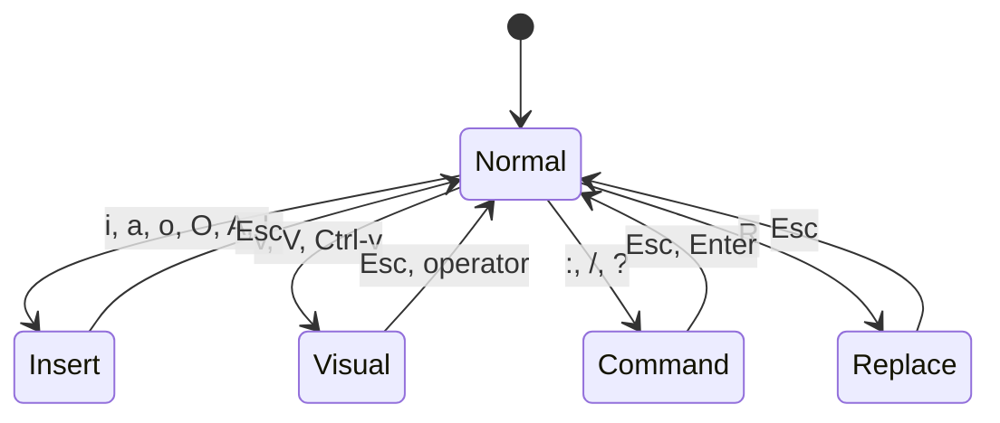

# Modes

Back: [/docs/spec/README.md](/docs/spec/README.md)
Modes are deterministic state machines driving intent generation.

## Mode Transition Diagram

## Directory Structure

| Directory | Content |
|-----------|---------|
| [insert/](insert/README.md) | Insert mode |
| [replace/](replace/README.md) | Replace mode |

## Core Mode Documents

| Document | Content |
|----------|---------|
| [normal.md](normal.md) | Normal mode |
| [visual.md](visual.md) | Visual mode |
| [command.md](command.md) | Command mode |
| [transitions.md](transitions.md) | Mode transitions |
| [configuration.md](configuration.md) | Mode configuration |

## Required Modes

| Mode | Purpose |
|------|---------|
| Normal | Navigation, operators, composition |
| Insert | Text entry, completion |
| Visual | Selection (char/line/block) |
| Command | Ex commands and search |
| Replace | Overwrite semantics |

## Cross-cutting Rules

| Rule | Requirement |
|------|-------------|
| Intent emission | Modes emit intents; core applies them |
| Predictable escape | Esc returns to Normal |
| No blocking | Transitions never wait on services |

## Related

- Editing: [docs/spec/editing/README.md](/docs/spec/editing/README.md)
- Commands: [docs/spec/commands/README.md](/docs/spec/commands/README.md)
