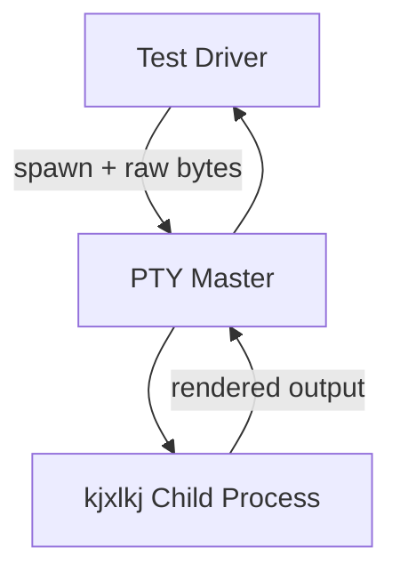

# PTY E2E Harness Contract

Back: [/docs/spec/technical/testing.md](/docs/spec/technical/testing.md)

Contract for the live PTY process harness used by blocker `*R` tests.

## Purpose

The harness runs the full `kjxlkj` binary in a pseudo-terminal, sends raw input bytes,
and captures rendered frames for deterministic assertions.

## Architecture

## Crate Location

Harness implementation lives in `src/crates/app/kjxlkj-test-harness/`.

## API Contract

| Operation | Requirement |
|---|---|
| spawn | create PTY process with explicit `cols` and `rows` |
| send raw bytes | inject exact byte stream without key abstraction loss |
| send symbolic key | helper layer maps key string to canonical bytes |
| wait for pattern | bounded wait with explicit timeout diagnostics |
| capture frame | return current frame text and cursor coordinates |
| resize | change PTY geometry and await propagation |
| quit | graceful exit within deadline |

## Key Encoding Requirements

| Key | Bytes |
|---|---|
| `a` | `0x61` |
| `A` (`Shift+a`) | `0x41` |
| `Ctrl-w` | `0x17` |
| `Esc` | `0x1B` |
| `Enter` | `0x0D` |
| arrows | ANSI escape sequences |

## Timeout and Boundedness Policy

| Operation | Default Timeout | Failure Signal |
|---|---:|---|
| spawn | 5s | startup timeout |
| pattern wait | 2s | expected pattern missing |
| frame capture | 500ms | output stalled |
| quit | 1s | graceful shutdown timeout |

## Determinism Rules

- no blind sleep; use polling with deadlines
- fixed PTY geometry per test unless resize is under test
- isolate filesystem fixtures per test case
- block external network dependency in E2E tests

## Required Failure Diagnostics

On failure, harness must include:

- mode
- focused window ID and type
- layout tree summary
- cursor/caret position
- last 20 raw input events
- last 20 resolved actions
- frame excerpt

## CI Policy

If PTY capability is unavailable, tests may be skipped only with explicit reason.
Skipped PTY cases do not count as blocker closure evidence.

## Related

- E2E matrix: [/docs/spec/technical/testing-e2e.md](/docs/spec/technical/testing-e2e.md)
- Testing contract: [/docs/spec/technical/testing.md](/docs/spec/technical/testing.md)
