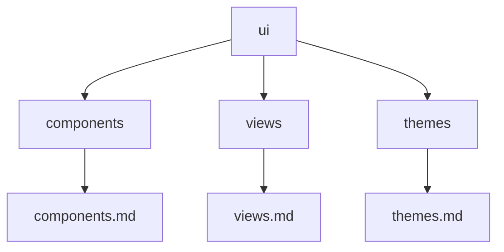

# UI Architecture

## Documents

| Document | Content |
|----------|---------|
| [components.md](components.md) | UI components |
| [views.md](views.md) | View system |
| [themes.md](themes.md) | Theme system |

## Map

