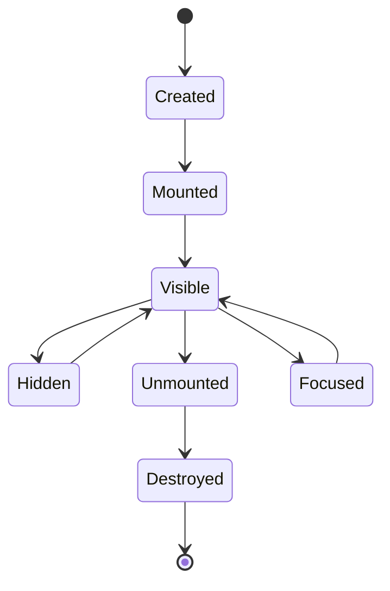

# Components

## Component taxonomy

| Role | Meaning |
|---|---|
| View | Panel-sized content container (editor, explorer, terminal). |
| Widget | Smaller UI element inside a view (statusline, gutters). |
| Modal | Overlay that temporarily captures focus (picker, confirm). |
| Primitive | Low-level reusable pieces (lists, borders, text layout). |

## Render contract

Components render from:

- Region geometry
- Theme/style data
- Immutable snapshot data

Components MUST NOT:

- Query services directly
- Read editor internals outside the snapshot

## Input contract

| Output type | Meaning |
|---|---|
| `Consumed` | Stop propagation. |
| `Ignored` | Parent may handle. |
| `Intent` | A typed request to the core (edit, navigation, open view). |
| `UIEffect` | UI-only effect (open modal, change focus). |

## Cross-component coordination

Cross-component actions occur via core-mediated intents.

Example: reveal a file in explorer.

- The initiating view emits an intent: “reveal path in explorer”.
- The core updates UI state (ensure explorer view exists) and produces a snapshot update.

## Lifecycle

## Related

- UI index: [README.md](README.md)
- View taxonomy: [views.md](views.md)
