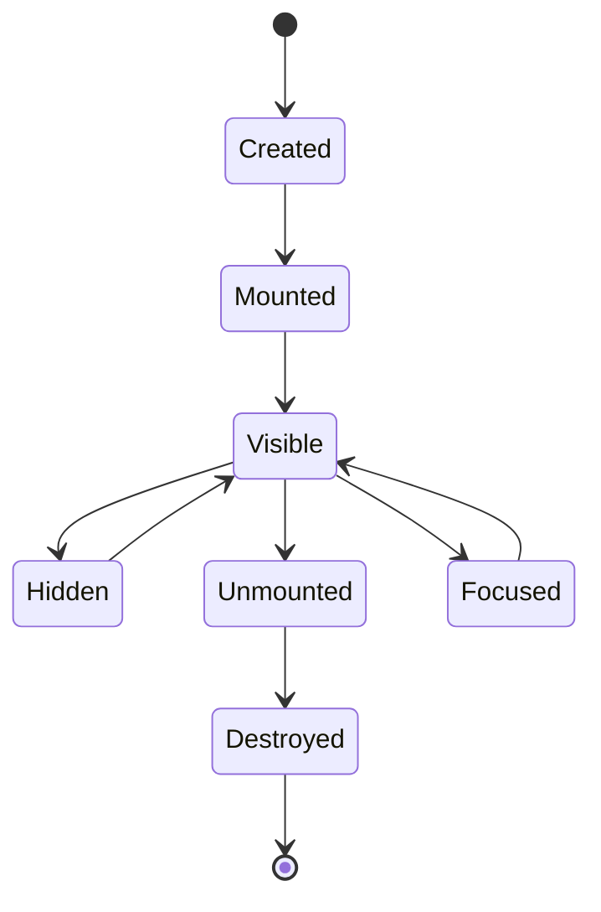

# Components

Back: [/docs/spec/ui/README.md](/docs/spec/ui/README.md)

Components are the building blocks of the kjxlkj user interface. Every visible element is a component instance positioned within the layout tree.

## Component taxonomy

| Role | Meaning | Examples |
|---|---|---|
| View | Panel-sized content container that fills a layout region. | Editor pane, file explorer, terminal, diagnostics list. |
| Widget | Smaller UI element rendered inside or alongside a view. | Statusline, gutter, breadcrumbs, scrollbar. |
| Modal | Overlay that temporarily captures all input focus. | Fuzzy picker, confirmation dialog, command palette. |
| Primitive | Low-level reusable building block composed into higher-level components. | Bordered box, text span, virtual list, icon. |

## Render contract

Every component receives three inputs when rendering:

| Input | Description |
|---|---|
| Region geometry | A rectangle defined by `(x, y, width, height)` in terminal cells. The component MUST NOT draw outside this region. |
| Theme and style data | The active theme's highlight groups and style overrides. The component MUST use these for all coloring. |
| Snapshot data | An immutable snapshot of the relevant editor state (buffer content, cursor position, diagnostics, etc.). |

Components MUST NOT query services, read files, or access mutable editor state during rendering. All data MUST arrive through the snapshot. This constraint ensures deterministic rendering and enables snapshot-based testing.

## Input contract

When a component receives a key or mouse event, it MUST return one of the following response types:

| Response | Meaning |
|---|---|
| `Consumed` | The component handled the event. Propagation MUST stop. |
| `Ignored` | The component did not handle the event. The parent MUST continue propagation up the tree. |
| `Intent` | A typed request directed at the editor core (e.g. insert character, navigate to line, open file). The core processes the intent and produces a new snapshot. |
| `UIEffect` | A UI-only side effect (e.g. open a modal, shift focus, scroll a panel). The UI layer handles it without involving the editor core. |

Input propagation MUST follow depth-first order: the focused leaf component receives the event first. If it returns `Ignored`, the event bubbles to its parent, and so on.

## Cross-component coordination

Components MUST NOT communicate directly. All cross-component actions flow through core-mediated intents.

| Scenario | Mechanism |
|---|---|
| Reveal file in explorer | The editor view emits an `Intent::RevealInExplorer { path }`. The core ensures the explorer view exists and updates the snapshot with the target path highlighted. |
| Jump to diagnostic | The diagnostics list emits an `Intent::GoToLocation { path, line, col }`. The core opens or focuses the relevant buffer. |
| Toggle panel | Any component emits a `UIEffect::TogglePanel { panel_id }`. The UI layer shows or hides the panel without core involvement. |

## Lifecycle

Every component MUST follow this lifecycle. Transitions outside this graph are invalid.

| State | Requirements |
|---|---|
| Created | The component struct is allocated. No rendering or input handling occurs. |
| Mounted | The component is attached to the layout tree. It MUST initialize any internal state needed for rendering. |
| Visible | The component is within a visible region. It MUST render when the frame is drawn. |
| Focused | The component is visible and has input focus. It MUST render its focused visual state (e.g. highlighted border). |
| Hidden | The component is mounted but not in a visible region (e.g. collapsed panel). It MUST NOT render or consume input. |
| Unmounted | The component is detached from the layout tree. It MUST release view-specific resources. |
| Destroyed | The component is dropped. All resources MUST be freed. |

## Widget specifications

| Widget | Requirement |
|---|---|
| Statusline | MUST render at the bottom of the editor area. MUST display mode, file name, cursor position, encoding, and file type. Segments MUST be configurable. |
| Gutter | MUST render to the left of each editor view. MUST support line numbers, sign column, and fold indicators. Every visible buffer row MUST show deterministic line identity. Width MUST adjust to accommodate the highest visible line number. |
| Breadcrumbs | SHOULD render above the editor view showing the file path and symbol hierarchy. Clicking a segment SHOULD navigate to that scope. |
| Scrollbar | SHOULD render on the right edge of scrollable views. The thumb size MUST be proportional to visible-to-total content ratio. |

## Modal specifications

| Modal | Requirement |
|---|---|
| Fuzzy picker | MUST capture all keyboard input. Typing MUST filter the list. `<Enter>` MUST confirm selection. `<Esc>` MUST cancel and return focus. |
| Confirmation dialog | MUST display a message and action buttons. MUST block other input until dismissed. |
| Command palette | MUST list all available commands filterable by fuzzy search. Selected command MUST execute immediately on confirmation. |

## Test requirements

| Test category | Minimum checks |
|---|---|
| Unit | render output for given snapshot, input response types, lifecycle transitions |
| Integration | intent propagation, cross-component coordination, focus cycling |
| Snapshot | deterministic render output for identical region + theme + data |

## Related

- UI index: [/docs/spec/ui/README.md](/docs/spec/ui/README.md)
- View taxonomy: [/docs/spec/ui/views.md](/docs/spec/ui/views.md)
- Themes: [/docs/spec/ui/themes.md](/docs/spec/ui/themes.md)
- Floating windows: [/docs/spec/features/window/floating-windows.md](/docs/spec/features/window/floating-windows.md)
- Gutter numbering: [/docs/spec/features/ui/gutter-line-numbers.md](/docs/spec/features/ui/gutter-line-numbers.md)
