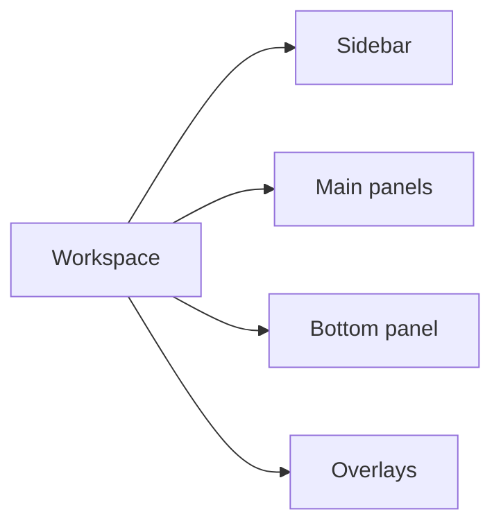

# Views

Back: [/docs/spec/ui/README.md](/docs/spec/ui/README.md)

Views are panel-sized components that fill a layout region and provide the primary interaction surfaces of the editor. Each view type has its own rendering logic, keybindings, and snapshot data requirements.

## View classes

| View | Purpose | Default location |
|---|---|---|
| Editor | Text editing, navigation, and inline diagnostics. | Main panel (center). |
| Explorer | Workspace file tree with create, rename, delete, and reveal operations. | Sidebar (left). |
| Finder | Fuzzy pickers for files, symbols, commands, and project-wide search results. | Overlay (centered float). |
| Diagnostics | Unified list for compiler errors, warnings, search results, and build output. | Bottom panel. |
| Git | Status view showing changed files, inline diff, blame annotations, and staging controls. | Sidebar or bottom panel. |
| Terminal | Embedded PTY panes running shell sessions. | Bottom panel or floating. |
| Undo tree | Visual history graph allowing navigation to any prior buffer state. | Sidebar (right) or floating. |

## Workspace topology

The workspace layout is divided into four regions. Each region MAY contain zero or more views.

| Region | Requirement |
|---|---|
| Sidebar | MUST support left and right positions. The sidebar MUST be togglable via `:SidebarToggle` or a keybinding. Width MUST be resizable by dragging the separator or via `:SidebarWidth {n}`. |
| Main panels | MUST contain at least one editor view. This region holds the split tree defined by the window system. |
| Bottom panel | MUST be togglable. Height MUST be resizable. The bottom panel SHOULD support tabbed sub-views (diagnostics, terminal, output). |
| Overlays | Floating windows and modals render here. They are managed by the floating window system and do not participate in the tiled layout. |

## View requirements

Constraints on view implementation.

### Editor view

| Topic | Requirement |
|---|---|
| Buffer binding | Each editor view MUST be bound to exactly one buffer. Multiple editor views MAY display the same buffer. |
| Viewport | The view MUST track `top_line`, `left_col`, and cursor position independently. |
| Gutter | The view MUST render a gutter containing line numbers (absolute, relative, or hybrid) and a sign column for diagnostics and git signs. |
| Soft wrap | When `wrap` is enabled, lines exceeding the view width MUST wrap visually without modifying the buffer. |
| Minimap | A minimap SHOULD be available as an optional right-edge widget showing a compressed overview of the buffer. |

### Explorer view

| Topic | Requirement |
|---|---|
| Tree rendering | MUST display the file tree with indentation reflecting directory depth. Directories MUST be collapsible. |
| File operations | MUST support create (`a`), rename (`r`), delete (`d`), copy (`c`), and paste (`p`) operations with confirmation. |
| Reveal | The `:RevealInExplorer` command MUST scroll the tree to and highlight the active buffer's file. |
| Filtering | The explorer SHOULD support a filter input to narrow visible entries by name pattern. |

### Finder view

| Topic | Requirement |
|---|---|
| Rendering | MUST render as a floating overlay with a text input at the top and a filtered results list below. |
| Fuzzy matching | Typing MUST filter results using fuzzy substring matching. Match highlights MUST be visually indicated. |
| Navigation | `Ctrl-N` / `Ctrl-P` or arrow keys MUST move selection. `<Enter>` MUST confirm. `<Esc>` MUST dismiss. |
| Sources | The finder MUST support pluggable sources: files, buffers, symbols, commands, grep results. |

### Diagnostics view

| Topic | Requirement |
|---|---|
| Grouping | Diagnostics MUST be groupable by file, severity, or source. |
| Navigation | Selecting an entry MUST jump the editor to the corresponding file, line, and column. |
| Severity icons | Each entry MUST display a severity indicator (error, warning, info, hint) using the appropriate highlight group. |
| Live update | The list MUST update automatically as LSP diagnostics arrive or are cleared. |

### Git view

| Topic | Requirement |
|---|---|
| Status list | MUST display modified, staged, untracked, and conflicted files. |
| Staging | The user MUST be able to stage and unstage individual files or hunks. |
| Inline diff | Selecting a file MUST show a diff preview. The diff MUST highlight added, removed, and changed lines. |
| Blame | `:GitBlame` MUST show per-line blame annotations in the gutter or a side panel. |

### Terminal view

| Topic | Requirement |
|---|---|
| PTY | Each terminal view MUST spawn a PTY process. The default shell MUST be configurable via `terminal.shell`. |
| Input modes | In terminal-insert mode, all keys except a configurable escape sequence MUST be forwarded to the PTY. In terminal-normal mode, standard navigation keys MUST apply. |
| Scrollback | The terminal MUST maintain a scrollback buffer. Scrollback size MUST be configurable via `terminal.scrollback_lines`. |
| Multiple instances | The user MUST be able to open multiple terminal views simultaneously. |

### Undo tree view

| Topic | Requirement |
|---|---|
| Graph | MUST display the undo history as a tree with branches for divergent edits. |
| Navigation | Moving to a node MUST restore the buffer to that state. |
| Diff preview | Selecting a node SHOULD show a diff between the current state and the selected state. |
| Timestamps | Each node SHOULD display a human-readable timestamp. |

## Focus management

| Rule | Requirement |
|---|---|
| Single focus | Exactly one view MUST have focus at any time. |
| Focus cycling | `Ctrl-W w` and `Ctrl-W W` MUST cycle through all focusable views in the tiled layout. Sidebar and bottom panel views MUST be included in the cycle when visible. |
| Focus memory | Each region SHOULD remember which view was last focused so returning to the region restores that view's focus. |

## Configuration

| Setting | Default | Description |
|---|---|---|
| `sidebar.position` | `"left"` | Sidebar position: `"left"` or `"right"`. |
| `sidebar.width` | `30` | Default sidebar width in columns. |
| `sidebar.visible` | `true` | Whether the sidebar is visible on startup. |
| `bottom_panel.height` | `15` | Default bottom panel height in rows. |
| `bottom_panel.visible` | `false` | Whether the bottom panel is visible on startup. |

## Test requirements

| Test category | Minimum checks |
|---|---|
| Unit | each view renders correctly for its snapshot data, input responses match expected types |
| Integration | focus cycling across regions, reveal-in-explorer, diagnostic navigation |
| PTY E2E | open sidebar, toggle bottom panel, open finder, select result, verify editor state |

## Related

- UI index: [/docs/spec/ui/README.md](/docs/spec/ui/README.md)
- Component contract: [/docs/spec/ui/components.md](/docs/spec/ui/components.md)
- Themes: [/docs/spec/ui/themes.md](/docs/spec/ui/themes.md)
- Window splits: [/docs/spec/features/window/splits-windows.md](/docs/spec/features/window/splits-windows.md)
- Floating windows: [/docs/spec/features/window/floating-windows.md](/docs/spec/features/window/floating-windows.md)
