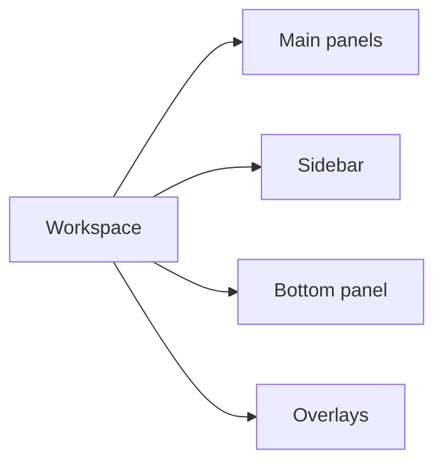

# Views

## View classes

| View | Purpose |
|---|---|
| Editor | Text editing and navigation. |
| Explorer | Workspace tree + operations. |
| Finder | Fuzzy pickers and project search. |
| Diagnostics | Unified list for problems/search/build output. |
| Git | Status, diff, blame, staging interactions. |
| Terminal | Embedded pty panes. |
| Undo tree | Visual history navigation. |

## Workspace topology

## Related

- UI index: [README.md](README.md)
- Component contract: [components.md](components.md)
