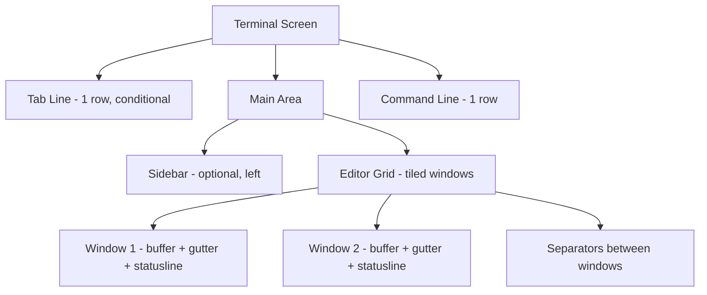

# Layout

Back: [/docs/spec/ux/README.md](/docs/spec/ux/README.md)

## Layout model

kjxlkj uses a snapshot-driven UI with persistent regions and transient overlays.

## Screen regions (normative)

| Region | Rows | Visibility | Content |
|---|---|---|---|
| Tab line | 1 | Shown when >1 tab page exists | Tab labels |
| Main area | terminal_rows - tab_line - cmd_line | Always | Sidebar + editor grid |
| Sidebar | configurable width | Toggled by command | File explorer, outline |
| Editor grid | remaining cols after sidebar | Always | Tiled windows with separators |
| Command line | 1 (expandable for messages) | Always | Commands, search, messages |

## Layout tree (normative)

The editor grid arranges windows in a recursive binary tree:

| Node type | Children | Description |
|---|---|---|
| `Leaf(window_id)` | None | A single window |
| `HSplit(ratio, left, right)` | 2 | Horizontal split; `ratio` is 0.0–1.0 for left width |
| `VSplit(ratio, top, bottom)` | 2 | Vertical split; `ratio` is 0.0–1.0 for top height |

Geometry computation traverses the tree top-down, allocating pixel rectangles. Separator lines consume 1 column (vertical) or 1 row (horizontal).

## Window anatomy (normative)

Each window consists of:

| Component | Width | Position |
|---|---|---|
| Gutter | line_number_digits + sign_col + fold_col | Left edge |
| Text area | remaining columns | After gutter |
| Statusline | full window width, 1 row | Bottom row |

## Constraints (normative)

| Constraint | Requirement |
|---|---|
| Keyboard-only | All layout manipulation MUST be keyboard-driven. Mouse input is ignored. |
| Minimum window size | Each window MUST have at least 1 text column and 1 text row (plus statusline). |
| Overlay cancellation | All overlays (pickers, completion, hover) MUST be instantly cancellable with `Esc`. |
| Snapshot rendering | Layout data is part of the `EditorSnapshot`; the render task MUST NOT query core for geometry. |

## Window commands (normative)

| Key / Command | Action |
|---|---|
| `Ctrl-w s` / `:sp` | Split horizontally |
| `Ctrl-w v` / `:vsp` | Split vertically |
| `Ctrl-w c` / `:close` | Close current window |
| `Ctrl-w o` / `:only` | Close all other windows |
| `Ctrl-w h/j/k/l` | Move focus left/down/up/right |
| `Ctrl-w H/J/K/L` | Move window to far left/bottom/top/right |
| `Ctrl-w =` | Equalize window sizes |
| `Ctrl-w +/-` | Increase/decrease window height |
| `Ctrl-w >/<` | Increase/decrease window width |
| `Ctrl-w T` | Move window to new tab |
| `Ctrl-w w` | Cycle to next window |
| `Ctrl-w W` | Cycle to previous window |

## Related

- UX hub: [/docs/spec/ux/README.md](/docs/spec/ux/README.md)
- Window model: [/docs/spec/editor/windows.md](/docs/spec/editor/windows.md)
- Statusline: [/docs/spec/features/ui/statusline/README.md](/docs/spec/features/ui/statusline/README.md)
- Render pipeline: [/docs/spec/architecture/render-pipeline.md](/docs/spec/architecture/render-pipeline.md)
